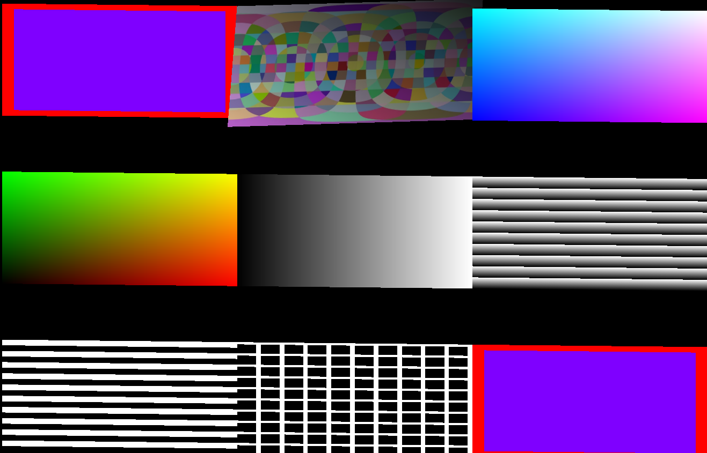

# Demo

- [https://stefanygeraldine.github.io/basic-shaders/](https://stefanygeraldine.github.io/basic-shaders/)

# Basic Practice of Shaders with Three.js

This project demonstrates a basic practice of using vertex and fragment shaders with Three.js. Shaders are small programs that run on the GPU and are used to control the rendering of graphics. By using shaders, you can create complex visual effects that would be difficult or impossible to achieve with standard Three.js materials.

## Introduction

Shaders are written in GLSL (OpenGL Shading Language) and can be used to control the vertex and fragment processing stages of the rendering pipeline. In this project, we will create simple vertex and fragment shaders that animate a flag waving effect on a plane geometry.
